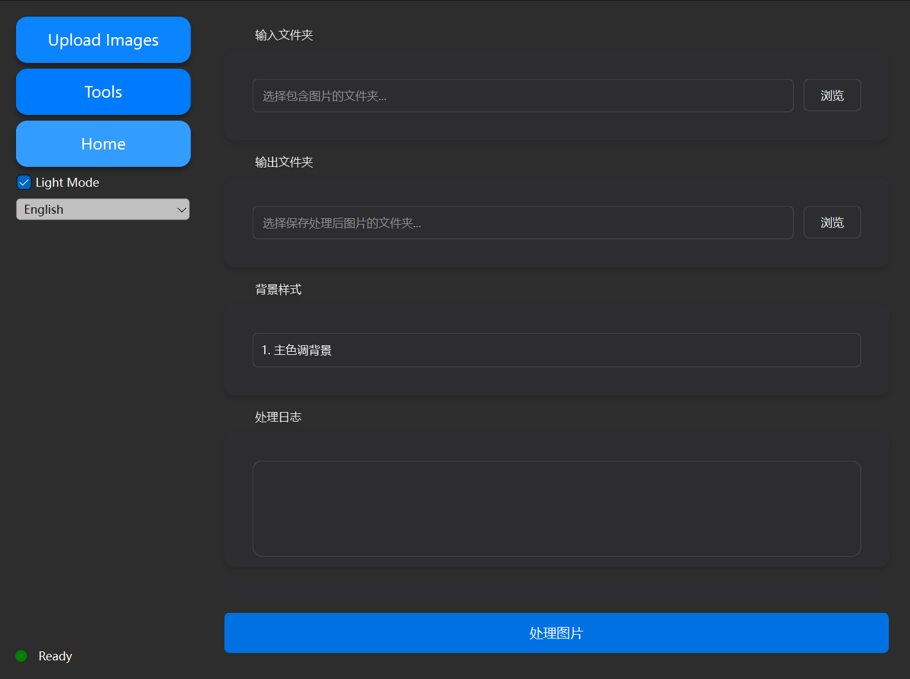
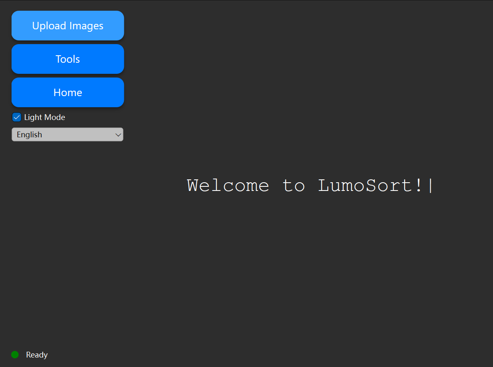
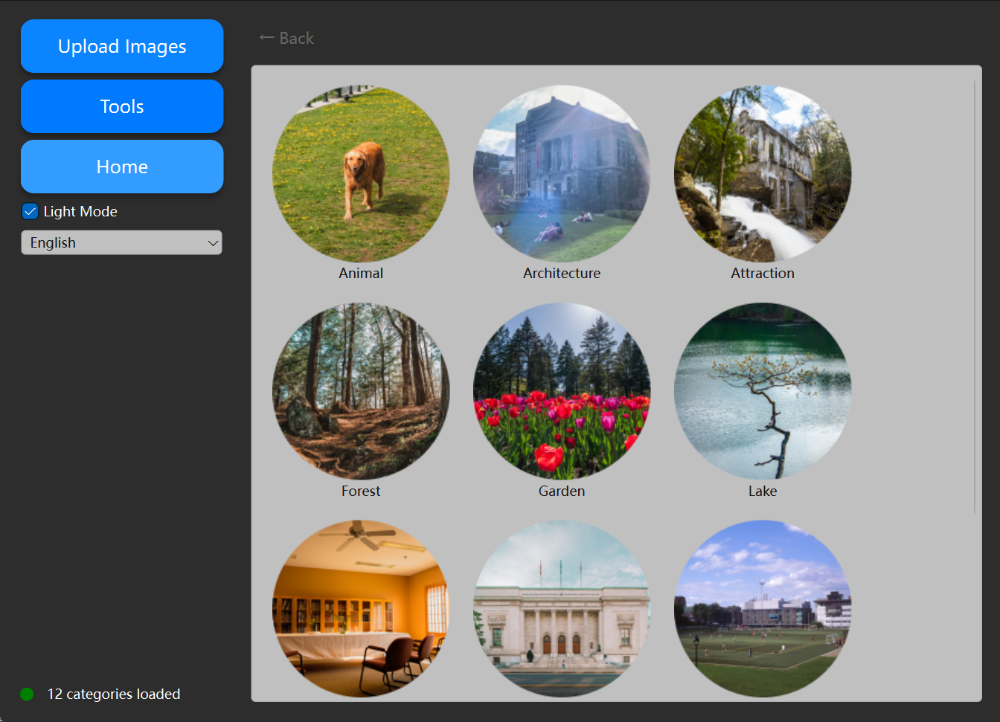

# 🌟 LumoSort — A Semantic-Aware Photo Organizer for Creators

<div align="center">
  <p>
    <a href="https://github.com/Jimmi1e/LumoSort/releases">
      
    </a>
    <a href="LICENSE">
      
    </a>
    <a href="https://www.python.org/downloads/release/python-3100/">
      
    </a>
  </p>
</div>

## 🎬 Background

I'm an amateur photographer and a Master's student in Electrical & Computer Engineering at **Concordia University**. In my daily photography, I rarely sort my photos into categories, which led to thousands of disorganized images. 📷🗂️ To solve this, I developed LumoSort, an application that can automatically organize my photo library by semantic categories.

## 🔗 Download

To support users in different regions, here are alternative download mirrors for the `LumoSort.exe` executable (
ℹ️ Note: The macOS version of LumoSort is currently under development and will be released soon.):

### 🌍 Google Drive(For Overseas Users)

If you're located overseas, you can use this Google Drive link to download the executable:

- [Google Drive: LumoSort.exe](https://drive.google.com/file/d/1Q1PDmydGXdkGiz8DSuEFRh-kS-JLrbTx/view?usp=drive_link)

### ☁️ Baidu NetDisk (For Mainland China Users)

If you're based in mainland China, please use the Baidu NetDisk link below:

- [Baidu NetDisk: LumoSort.exe](https://pan.baidu.com/s/1t4fvGvutQemTQ0fstptRtw?pwd=6qym)  
  提取码：`6qym`

## ✨ Features

**LumoSort** is a desktop application that helps you automatically classify and organize your photo collections into semantic categories such as *Portrait*, *Street*, *Architecture*, *Food*, and more.

Built with **OpenAI CLIP** and **PyQt6**, it features:

- 🎨 Modern animated UI with Light/Dark mode
- 🌐 Multilingual support (10+ languages)
- 🤖 Local image classification
- 📱 Responsive design
- 🖼️ Background processing tools

### 📸 Screenshots

<div align="center">
  
  <p><em>Main Interface - Dark Mode</em></p>
  
  
  <p><em>Category View with Image Classification</em></p>
  
  
  <p><em>Tools Interface - Background Processing</em></p>
</div>

---

## 📊 How It Works

LumoSort uses OpenAI's [CLIP](https://github.com/openai/CLIP) model to classify images by comparing them with a list of text prompts describing various categories. The model computes similarity scores between image and text embeddings and selects the most likely label.

### Key Features

* 🧠 Uses `ViT-B/32`, a Vision Transformer-based CLIP model
* 📂 Includes 20+ categories like `Portrait`, `Food`, `Street`, `Library`, `Nature`, etc.
* 🔄 Automatically groups and copies images into corresponding folders
* 💻 Modern PyQt6 GUI with:
  * 🌓 Light/Dark mode support
  * ⏳ Real-time progress tracking
  * 🎯 Grid-based album view
  * 🔍 Individual preview mode
  * 🌍 Multilingual interface

---

## 📦 Manual Model Downloads

Due to GitHub file size restrictions, two required files must be downloaded manually:

### 1. CLIP Model Weights: `ViT-B-32.pt`

* 🔗 [Download ViT-B-32.pt](https://openaipublic.blob.core.windows.net/clip/models/ViT-B-32.pt)
* 📁 Place in: `models/ViT-B-32.pt`

### 2. Tokenizer Vocabulary: `bpe_simple_vocab_16e6.txt.gz`

* 🔗 [Download bpe_simple_vocab_16e6.txt.gz](https://openaipublic.blob.core.windows.net/clip/bpe_simple_vocab_16e6.txt.gz)
* 📁 Place in: `clip_vocab/bpe_simple_vocab_16e6.txt.gz`

---

## 📁 Directory Structure

```bash
LumoSort/
├── main.py               # Application entry point
├── gui_qt.py            # Main GUI implementation
├── Classifierpy.py      # CLIP classifier logic
├── labels.py            # Category definitions
├── icon/
│   └── logo.ico         # Application icon
├── models/
│   └── ViT-B-32.pt     # <- manual download
├── clip_vocab/
│   └── bpe_simple_vocab_16e6.txt.gz  # <- manual download
├── requirements.txt     # Dependencies
└── ...
```

---

## 🚀 Getting Started

```bash
# Create a virtual environment
conda create -n lumosort python=3.10
conda activate lumosort

# Install dependencies
pip install -r requirements.txt

# Launch the application
python main.py
```

---

## 🔧 Building Executable (Windows)

```bash
pyinstaller main.py --onefile \
  --icon=icon/logo.ico \
  --add-data "models/ViT-B-32.pt;models" \
  --add-data "clip_vocab/bpe_simple_vocab_16e6.txt.gz;clip_vocab"
```

Ensure `sys._MEIPASS` is handled properly when accessing resources inside your code (e.g., tokenizer path).

---

## 👤 Author

Created by Jiaxi Yang

## 🙏 Acknowledgments

Special thanks to:
- [Photo_background](https://github.com/waterkingest/Photo_background) by @waterkingest for providing inspiration for the background processing features
- The open-source community for their invaluable tools and libraries

## 📄 License & Attribution

This project is released under the MIT License.

If you use LumoSort or its components (UI, classifier design, or visuals) as part of a derivative work, **please include a visible attribution** such as:

> "Based on [LumoSort](https://github.com/Jimmi1e/LumoSort) by @Jimmi1e"

This helps support the original author and gives proper credit. Thank you!

