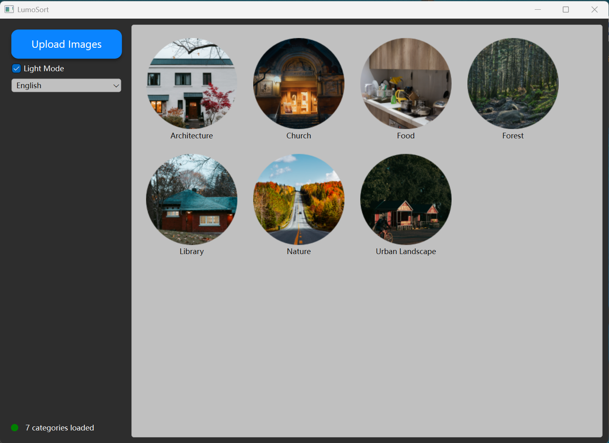

# 🌟 LumoSort — A Smart Image Classifier with CLIP + PyQt6
## 🎬 Background

I'm an amateur photographer and a Master's student in Electrical & Computer Engineering at **Concordia University**. In my daily photography, I rarely sort my photos into categories, which led to thousands of disorganized images. 📷🗂️ To solve this, I developed LumoSort, an application that can automatically organize my photo library by semantic categories.
## ✨ Preface
**LumoSort** is a desktop application that helps you automatically classify and organize your photo collections into semantic categories such as *Portrait*, *Street*, *Architecture*, *Food*, and more.

Built with **OpenAI CLIP** and **PyQt6**, it features a modern animated UI, multilingual support, and local image classification.



---

## 📊 How It Works

LumoSort uses OpenAI's [CLIP](https://github.com/openai/CLIP) model to classify images by comparing them with a list of text prompts describing various categories. The model computes similarity scores between image and text embeddings and selects the most likely label.

* Uses `ViT-B/32`, a Vision Transformer-based CLIP model
* Includes 20+ categories like `Portrait`, `Food`, `Street`, `Library`, `Nature`, etc.
* Automatically groups and copies images into corresponding folders
* Includes a PyQt6 GUI with:

  * Light/Dark mode
  * Real-time progress
  * Grid-based album view and individual preview mode
  * Multilingual interface

---

## 📦 Manual Model Downloads

Due to GitHub file size restrictions, two required files must be downloaded manually:

### 1. CLIP Model Weights: `ViT-B-32.pt`

* 🔗 [Download ViT-B-32.pt](https://openaipublic.blob.core.windows.net/clip/models/ViT-B-32.pt)
* 📁 Place in: `models/ViT-B-32.pt`

### 2. Tokenizer Vocabulary: `bpe_simple_vocab_16e6.txt.gz`

* 🔗 [Download bpe\_simple\_vocab\_16e6.txt.gz](https://openaipublic.blob.core.windows.net/clip/bpe_simple_vocab_16e6.txt.gz)
* 📁 Place in: `clip_vocab/bpe_simple_vocab_16e6.txt.gz`

---

## 📁 Directory Structure

```
LumoSort/
├── main.py
├── gui_qt.py
├── Classifierpy.py
├── labels.py
├── icon/
│   └── icon.ico
├── models/
│   └── ViT-B-32.pt             # <- manual download
├── clip_vocab/
│   └── bpe_simple_vocab_16e6.txt.gz  # <- manual download
├── requirements.txt
└── ...
```

---

## 🚀 Getting Started

```bash
# Create a virtual environment
conda create -n lumosort python=3.10
conda activate lumosort

# Install dependencies
pip install -r requirements.txt

# Launch the application
python main.py
```

---

## 🔧 Building Executable (Windows)

```bash
pyinstaller main.py --onefile \
  --icon=icon/icon.ico \
  --add-data "models/ViT-B-32.pt;models" \
  --add-data "clip_vocab/bpe_simple_vocab_16e6.txt.gz;clip_vocab"
```

Ensure `sys._MEIPASS` is handled properly when accessing resources inside your code (e.g., tokenizer path).

---

## 👤 Author

Created by Jiaxi Yang

## 📄 License & Attribution

This project is released under the MIT License.

If you use LumoSort or its components (UI, classifier design, or visuals) as part of a derivative work, **please include a visible attribution** such as:

> "Based on [LumoSort](https://github.com/Jimmi1e/LumoSort) by @Jimmi1e"

This helps support the original author and gives proper credit. Thank you!

